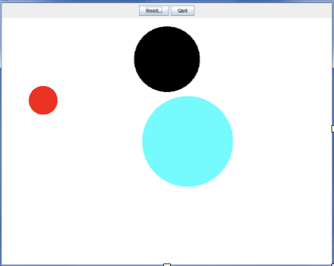

# Dot Drawing Program (Java GUI + File I/O + Exceptions)

This Java project is a dot-drawing application I developed for my CS 46B course (Data Structures & Algorithms in Java). It uses object-oriented design, Java I/O, exception handling, and a simple GUI to visualize dots read from a structured text file.

## Project Description

The program allows users to load a `.txt` file containing dot descriptions, each defined by a color, x/y position, and radius. Once loaded, the application parses the data, validates it, and draws each dot onto a graphical canvas. I implemented input parsing, error checking, exception handling, and object visualization from scratch.

The application structure follows a modular design with a focus on data validation and extensibility.

## Features

- **File I/O**: Reads comma-separated values from a text file using `BufferedReader`.
- **Exception Handling**:
  - Throws an `IllegalArgumentException` for unsupported colors.
  - Includes a custom `DotException` class to handle malformed file input.
- **Custom Classes**:
  - `Dot.java`: Represents individual dots with color, coordinates, and radius.
  - `DotReader.java`: Parses dot data from a file and constructs objects.
  - `DotException.java`: Handles non-standard formatting errors.
  - `DotDisplay.java`: Uses Java AWT/Swing to render dots visually in a window.
- **Graphical Interface**:
  - Simple Java Swing GUI with a “Read” button to load and render dot data.
- **Data Validation**:
  - Validates color against a fixed list of legal values.
  - Validates input formatting and field types.
- **Debugging Support**:
  - Includes a `main()` method and breakpoint-friendly design for testing and inspection.

## Sample Output

**Graphical Output Example:**

**Theme Inspiration:**

## File Format

Each line in the input file must include:

COLOR,X,Y,RADIUS

Example:

RED,100,200,20

## Running the Program

1. Clone the repository or download the files.
2. Open the project in Eclipse or any Java IDE.
3. Ensure all source files are in a `dotlab` package.
4. Compile and run `DotDisplay.java`.
5. Click "Read..." to open the input file (e.g. `3dots.txt`) and view the visual output.

## Technologies Used

- Java
- AWT/Swing
- Exception Handling
- File I/O
- Eclipse IDE

## Reflections

This project helped me strengthen my understanding of file parsing, object-oriented principles, custom exception design, and basic GUI programming. Debugging and validation played a crucial role in ensuring robustness and user-friendly feedback when dealing with bad input.

---

**Author**: Richa Vakharia  
**Course**: CS 46B – Data Structures & Algorithms in Java

